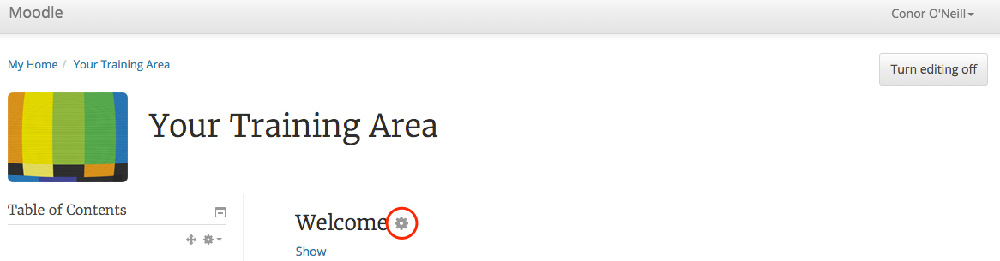
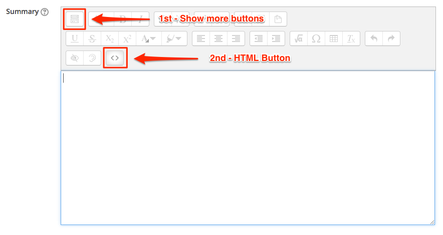
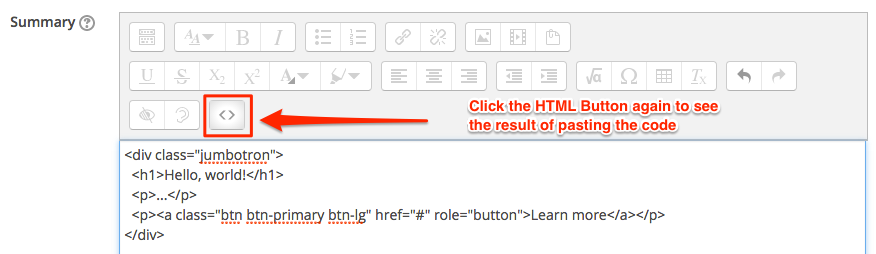
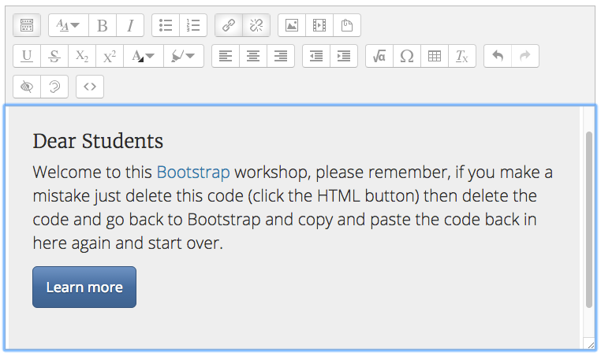

#Integrate Bootstrap into Moodle

In this next step we will look at the Process of taking a bootstrap component (like a Jumbotron) and integrating it into Moodle, one thing you need to remember is that it dosent matter if you make a mistake you can always just go back to a previous step and start again.

##Decisions Decisions

While certain Bootstarp compontents lend them selves to certain areas in a Moodle module, sometimes you just need to decde on a location that suits what exactly who are trying to achive. So for instance in the welcome section is normal to use a Jumbotron, but a Jumbotron might look out of place in some other section.

Sometimes all you want to do is provide navigation or highlight some instructions to students, sometimes you might want to make the studsent aware of a situation for instance when or how they need to reply to a popst in a discussion forum.

What bootstrap will allow you to do is provide a better more ingaging expierance through applying a different struture using bootstrap.

##The Welcome Section

Remember we copied the `code` for the [Jumbotron](http://getbootstrap.com/components/#jumbotron) now visit this page again and hit the copy button to copy the code to your clipboard.

Now, back in your Moodle web browser tab open **your Training Module** and Turn Editing on (click the button top right), now, click on the cog wheel alongside the Section name (Welcome)

#This is how we get Bootstrap code into Moodle 

We now ned to get set up so Moodle can take the code, click the show more buttons 1st then the HTML butoon 2nd, now paste in the code you just copied (CTRL V) 

When you click the HTML button again your should see the Jumbotron, **Note** this process of _copy and paste_ is same process we use each time we go from the bootstrap website to Moodle, its just what you want anf copy and paste to any palce in Moodle that has a HTML button

Now we need to change the text in the Jumbotron so that we can include our own message to the students, you can do this by simply changing the Heading and the message, delete what is currently in place then re-type your own text.

After you delete the default text and place your own text in there you shpuld have something that looks like the image below.

Thats it, well done, you just got your first peice of bootstrap into Moodle :)

*Continute to Step 04*

