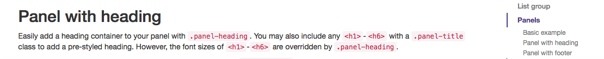
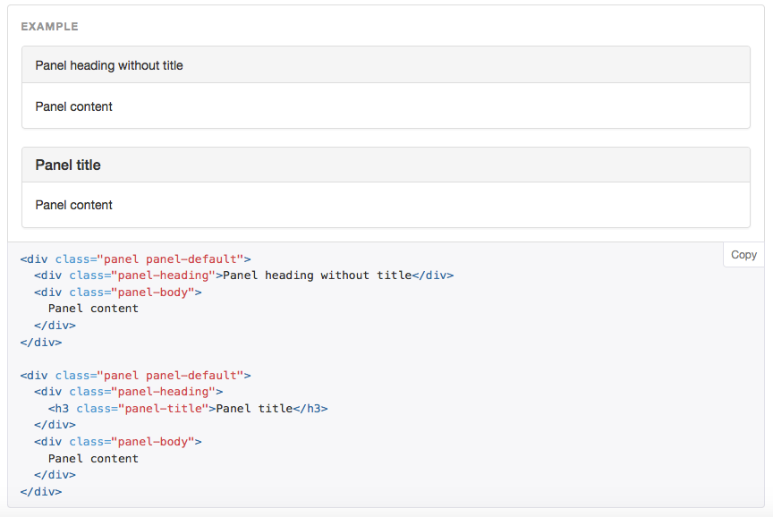

#Section Headers

As you can see from your training module each section (Table of Contents) has a default title of Section 1, Section 2 etc. We should name these section header with meaningful names, rename section 1 to 'Bootstrap Stuff' by clicking on the cog wheel alongside the section header (section 1), untick the default box and enter the name 'Bootstrap Stuff'


##Panel's

Go back to your Bootstrap tab and look for a component called [Panels](http://getbootstrap.com/components/#panels)



We want to use a panel at the top of our new section in Moodle (the one you just called Bootstrap Stuff) we want to place a panel there, again, we are going to just copy some code and paste it into the header, first we need to have a look at the code we want to copy, we want a panel with a title so we just need that code.



##Which code?

This time we dont need to copy all the code just the part we need, in some case's we only need certain parts of a component, for instance, with panels we have panels with and without titles, we want the panel with a title, however bootstrap displays all the code for both with and without panel titles in the same window. See image below for the code you need.


##The copy and paste process again

Copy just the that piece of code and go back to your module in Moodle, goto the section named 'Bootstrap Stuff' and click on the cog wheel along side that section name. Again go through the same process of clicking on the Show more Buttons and then the HTML button


Now we can paste in the code for the panel with a title, again to see what it looks like just click on the HTMl button again.


##Change the text

We can change the text now, again hightlight the header where its say 'Panel Title' and change it to 'Introduction' and type some message that describes the section contents, in this case something about bootstrap.


##Make some improvements

This still needs some work, so what we could do is make the panel title bold and we will change the color to match the Moodle Theme.
Go back and click on the HTML button and delete your code, then _copy and paste_ the code below back in again, do you notice any changes in the code ? Compare the first line to what you originally had.

```html
<div class="panel panel-info">
  <div class="panel-heading">
    <h3 class="panel-title"><b>Introduction</b></h3>
  </div>
  <div class="panel-body">
    In this section we will look at some basic Bootstrap components and how we can integrate them into Moodle<br></div>
</div>
```

##Where do we get tne colors?

Have a look at the imake below for some different colors


##Finished Panel

This is the finished panel - save you work now.


##Conclusion

Now we have intruduced color, and we can use different colors, in this case we change the code so that panel uses 'info' instead of 'default' we have also looked at panles and again we use the same **Process** to integrate the `code` into Moodle

*Continue to step 05*

