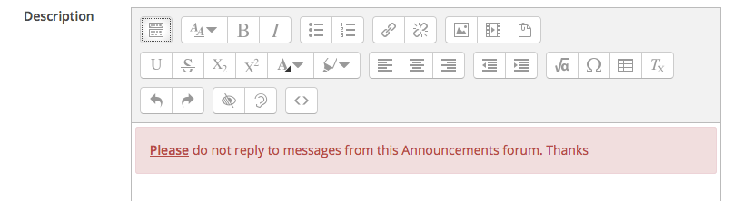

#Alerts

Another Bootstrap component is Alert, these can be used to "Alert" users to a particular instruction or some important information.


##Different Alerts

As you can see from the image above there are different type of Bootstrap alerts and each one can be used in different situation, we might use the 'Green' alert when a student finishes a quiz, we might use an 'Red' alert when issing some important instructions to students

##In Announcements

Back in you Moodle Training area we will include an alert to student letting them know if they they are not allowed to reply to posts in the Announcements forum

- Turn editing on and in the Welcome section click show
- Click on Edit beside the 'Announcements' activity and then Edit Setings
- Make dure the **Format** is set to HTML Format

##In Bootstrap

In your Bootstrap tab, navigate to the [Alert compontent](http://getbootstrap.com/components/#alerts) in Bootstrap and copy the last line of code, **Danger** this will copy the 'Red' Alert (Dont Panic :)


We will paste this line of code into our Announements forum, we will do this because we want to let the student know that when they recive an Announcement that you, the Lecturer, do not want them to reply. We have permissions in place to prohibit this, however the students wont know about that. 

##Back in Announcements

In Edit mode, edit your Announcements activity, 

- click on the Show more Buttons then the HTML button and paste in the line of code you just copied.

Currently its says 'General news and announcements' delete that and paste in the line of code. Now we can change the contents of the alert to make it more useful to us.

So, currenly this line of code

```html
<div class="alert alert-danger" role="alert">...</div>
```

Results in 


So if you changed ... to your message, or just copy what i have below 

```html
<div class="alert alert-danger" role="alert"><u><b>Please</b></u> do not reply to messages from this Announcements forum. Thanks<br></div>
```
You should end up with whats on the image below, this is what the student will see of they read you message in moodle, you can also paste an aleart into an actial post so that the students will see this alert in the actual post.



 
 *Continue to Exercises*
 


