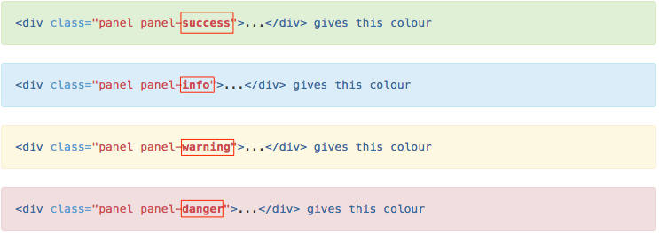

#Tags Tags and more Tags

As you can see from the previous Lab, to use Bootstrap Conponents in Moodle we need t ounderstand what tags are, so just in case you don't know what tags are, here's the quick explanation.

#What is HTML

HTML is a markup language used to describe or structure the contents of web pages, HTML stands for **H**yper **T**ext **M**arkup **L**anguage, and a markup language is a set of markup tags

#Basics tag's

_Headings_
```html
<h1>This is a heading</h1>
<h2>This is a bigger heading</h2>
<h3>This is an even bigger heading</h3>
```

_Paragraphs_
```html
<p>This is a paragraph.</p>
<p>This is another paragraph.</p>
```

When we use HTML files we use HTML tags to describe or structure the content of the page, we use tags to describe a HTML element which is made up of a **start tag** and an **end tag** and some content in between - start tag `<start>` end tag `</end>`

_Hyperlinks_
```html
<a href="#">This is what bootstrap will give you</a>
```

With Bootstrap we normally get a blank hyperlink so we must replace the # with an actual web address and some description of the link
```html
<a href="http://moodle.wit,ie">This is a a link to Moodle</a>
```
_The `<div>` tag_

You will have noticed that bootstrap uses div tags, div tags are a way of defining seperate sections within a HTML page, div tags will have a start tag `<div>` and an end tag `</div>`

```html
<div class="panel panel-info">
  <div class="panel-heading">
    <h3 class="panel-title">Panel title</h3>
  </div>
  <div class="panel-body">
    Panel content
  </div>
</div>
```

You can see from the code above that bootstrap "wraps" most components in a `<div>` "opening and closing" tag but you will also notice that it uses the **class** attribute, most bootstrap components are using this structure, and just in case you were wondering where the different colors come from have at look at the image below.



#HTML Attributes

HTML attributes provide additional information or functionality for an HTML element, attributes always consists of a pair e.g: name="value" We can see above we used an `<a>` tag, which is a link tag, we used the href attribute to link to a website.

##Conclusion

 The main point to remember about tags and elements is that every start tag must have a closing tag, and that most elements will use an attribute i.e. `href="value"` or `class="value"`

 *Continue to step 02*
