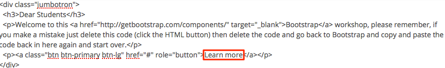
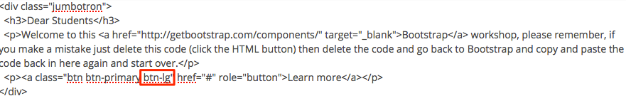

#URL - Web Address

We know that the web address or URL (Unversal Resource Locator) of [Moodle](https://moodle.wit.ie) is https://moodle.wit.ie the [Bootstrap](http://getbootstrap.com/) URL is http://getbootstrap.com/

Okay you know that, but this also means that all resources and activities in Moodle has a URL, so a discussion forum, quiz, file, etc has its own URL, this means that when you click on a discussion forum the URL changes, we can use these URL's to hyperlink from a bootstrap component (Button) to the activity/resource from within your module.

##Hyperlink

We can use a hyperlink to link from the button in our Jumbotron to the Announcements discussion forum.


Back in your training module, and go to your Jubbotron, you can see if you click on the Learn More Button nothing happens
We need to put a hyperlink behind the button so that when someone clicks it the hyperlink will send them to that location

##Announcments

- Back in your module notice the URL it say something like 'https://moodle.wit.ie/course/view.php?id=84871'
- click on the Announcements activity - again notice the URL its should have changed - **copy that URL**
- Turn editing on and go to you Jumbotron code - same process as before, 'Show more Buttons' then the HTML button
- Look for the code where its say href='#' and replace the # with the URL you just copied


- Save your work, now click on the 'Learn more' button, you should be now at a new location (the Announcements)

See, Easy :)

- Go back into your code for the jumbotron, we need to change 'Learn more' to 'Announcements'



- While your in the code for the jumbotron, we need to change the size of the 'Announcements' button, currently is too big
- We need to reduce the size if the button a little - change the btn-lg to **btn-md** (see image below)



 Your code should end up like this

```html
 <div class="jumbotron">
   <h3>Dear Students</h3>
   <p>Welcome to this <a href="http://getbootstrap.com/components/" target="_blank">Bootstrap</a> workshop, please remember, if you make a mistake just delete this code (click the HTML button) then delete the code and go back to Bootstrap and copy and paste the code back in here again and start over.</p>
   <p><a class="btn btn-primary btn-md" href="THE-WEB-ADDRESS-OF-YOUR-ANNOUNCMENTS" role="button">Announcements</a></p>
 </div>
```

##Conclusion

 We can use bootstrap buttons to link to many activities and resources in Moodle, its just a case of deciding when its appropriateß to use different components, sometime less is more :)

 *Continue to Step 03*
