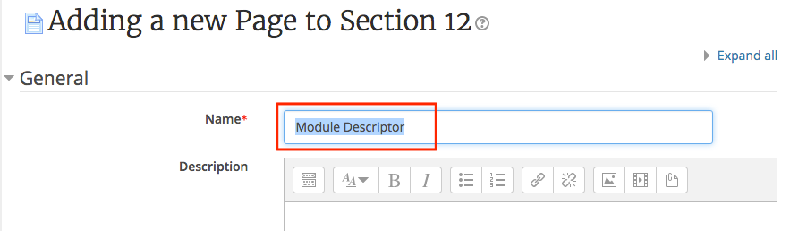
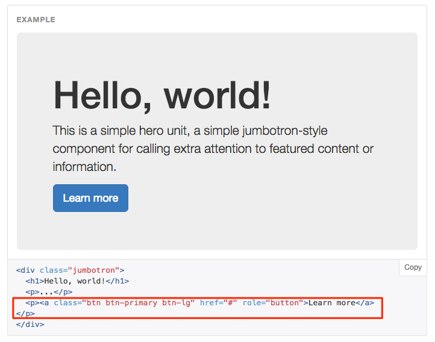
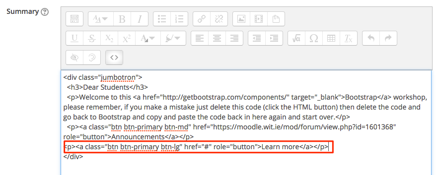
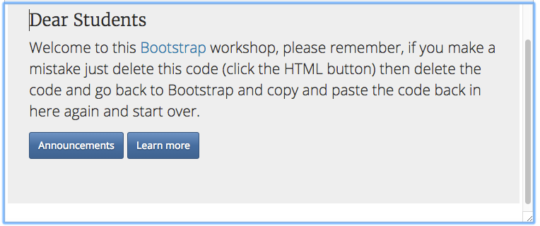
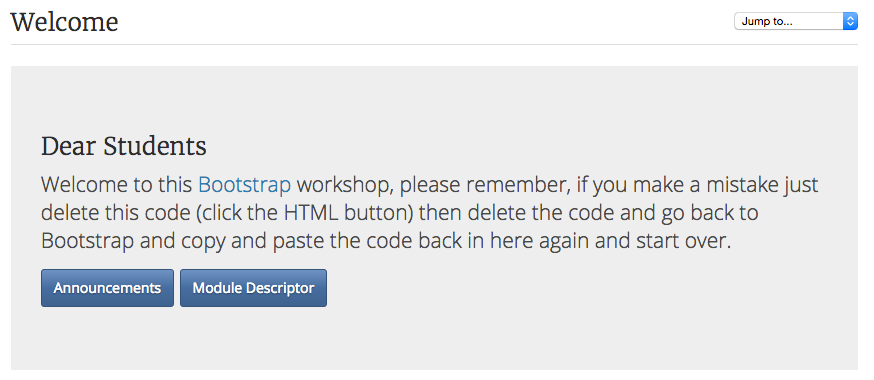

#Linking to Activities

We are going to create a page in Moodle then link to that page from out Jumbotron, we will now start to **nest** components inside other components, in this case an extra button inside a Jumbotron.

##Moodle Page

Back in your training module navigate to section 12, turn editing on, add a **Resource** (Page)


Call this new page Module Descriptor



Back in the Bootstrap tab of your browser copy the code for a panel "with a title" make sure you change the value of the attribute from `<div class="panel panel-default">` to `<div class="panel panel-info">` the code is below - take this and copy this code into the **Content** window (same process as before click show more button then click the HTML button)

```html
<div class="panel panel-info">
  <div class="panel-heading">
    <h3 class="panel-title">Panel title</h3>
  </div>
  <div class="panel-body">
    Panel content
  </div>
</div>
```


##Bootstrap your Module Descriptor page

Now we are going to use some Bootstrap panels to create 'Sections' of our new module descriptor page.
- Copy and paste this code into the Content (Page Content) **four** (4) times, under each other.
- The first Panel title is **Module Description/Aims** the second panel title is **Learning and Teaching Methods** the third panel title is **Indicative Content** the fourth and last panel title is **Learning Outcomes** You can add more panels if you wish.

##Create a new Button in Jumbotron

- In your Jumbotron, we will create a new button that will link to this new page, turn editing on, and in your Jumbotron navigate to the code.

- In your bootstrap tab navigate to the Jumbotron component and copy the line of code just for the button



- now paste this line of code beneath your announcements button in the Jumbotron code in your training area



- now if you view the changes but clicking the HTML button `< >` you should see the following


As you can see we have a problem, we would prefer if the buttons were horizontal, to fix that we need to look at the tags, remember we have and opening tag `<p>` then we should have a closing tag `</p>` and the content inside, this all makes up that HTML element, if we remove both the inner `</p>` and `<p>` this will resolve the problem.


Also don't forget to change the size if the button to **btn-md**



##Get the URL of your Page

The new button is in place but it does not link anywhere, we will now link this button to the page we created. You have and content of you page and the structure is complete, we need to get the web address of that page now.

- Click on your page (Module Descriptor) from the module page, notice that the URL has changed in the address bar, copy this address.

- go back to the Jumbotron code and replace the # thats after in the `href="#"` attribute and change "Learn More" to "Module Descriptor"



#Conclusion

Now you ave started to integrate component into other componentsntents and we have looked at URLs and HTML elements, attributes and tags, remember that you can go back at any stage to recap on a step.

*Continue to Step 04*
