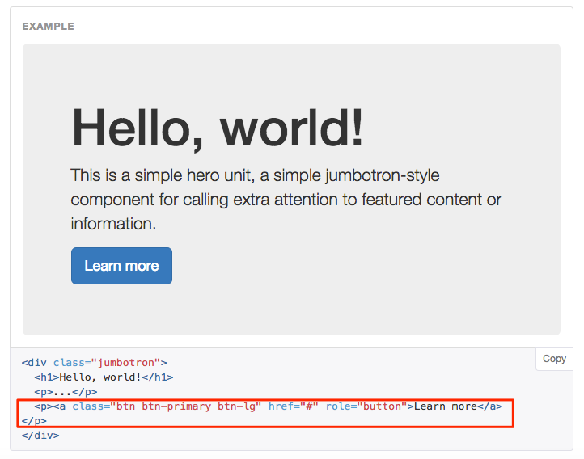

#The Hidden Section Concept

We are starting to use bootstrap to link to activities and resources now, and some of these activities and resources are in the same section, and if this is the case the users can see them, which kind of defeats the purpose of putting in some bootstrap in you Module.

In order to workaround this we can use what we call a "Hidden Section". This is just another section, usually the last section renamed to Hidden Section, we then hide this section by closing the eye, now the student wont be able to see the contents of this section, which is where we will store our activities and resources.

##The Watercooler

- In section 12 of your training module click on the section header cog wheel and rename the section to Hidden Section.
- Add a forum activity and call the The Watercooler
- Because you created this forum in a hidden section it will be hidden by default, edit this activity and click Show.

##The link

We will link to this forum from the panel in Section 2 (Bootstrap Stuff)

- Goto to the Bootstrap Stuff section and click on the cog wheel to edit the contents of the section header, remember we have already put a panel in there, now we are going to inter=grate a button inside that component.

- Go to the code window via the usual method (Show more buttons, HTML button)
- Next on your Bootstrap tab in you browser copy the code for the Button in the jumbotron.

- Back in Moodle paste the code into the panel code before the second last `
` dont forget to change the size of the button to btn-md and also re-nane the button from "Learn More" to "The Watercooler" save you work.

#Back on the Module page

- From the module page click on the The Watercooler, note the change in the URL, copy this URL.
- go back to the panel header in Bootstrap Stuff and paste URL into the href="#" attribute, replacing the # with the URL you just copied, save your work.

##Conclusion

As well as introducing nested components we have also looked at the concept of using a hidden section where we can hide the section and its contents but link to them from other section in the module.

*Continue to step  05*
