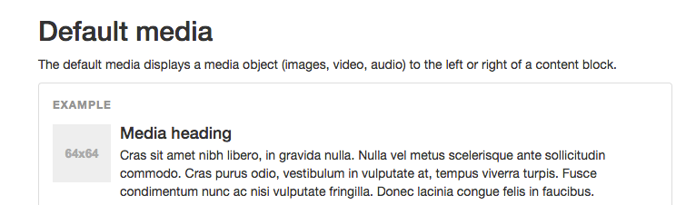
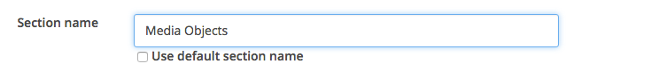
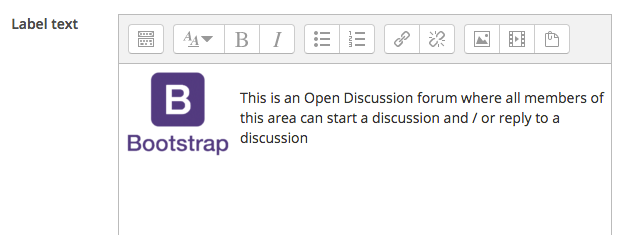
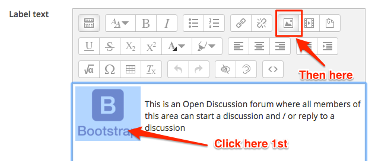

#What cant we use?

We can use lots of Bootstrap components that we can use, however, there are some other components that we can not used because most components are integrated into a Moodle resource called a label, label's or section headers together with pages are most common areas to slot in bootstrap components, we also used discussion forums and forum posts, assignment headers etc.

Because Moodle uses a theme and all of the resources and activities have a certain size some Bootstrap components are designed to be used independently of a system that has its own styling such as Moodle, Bootstrap was designed to be used in styling websites where the developers have total control over interactive components such as search components and drop-downs.

##Media Lists

Media lists are useful in some cases, we can use them to introduce Module sections or we could used them for Discussion forum or posts

- In your Bootstrap tab navigate to Media Objects, you should see some thing like the image below



- in section 3 of your Training Module rename the section to Media Objects



##Create a label

- We want to create a media object that looks something like this



- Create a label in your Media Objects section and copy and paste the code below into the HTML area

```html
<div class="media">
  <div class="media-left media-middle"><br></div>
  <div class="media-body">
    <p>This is an Open Discussion forum where all members of this area can start a discussion and / or reply to a discussion</p>
  </div>
</div>
```

##Import the Image
- you will need to click on the image and then click on the media icon and import your own image.



##Conclusion

That's it for Lab02, we have looked at Media objects in this step and we also touched on some restrictions of some components.

*Continue to Exercises*
