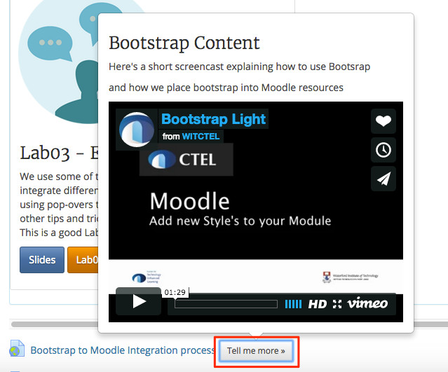
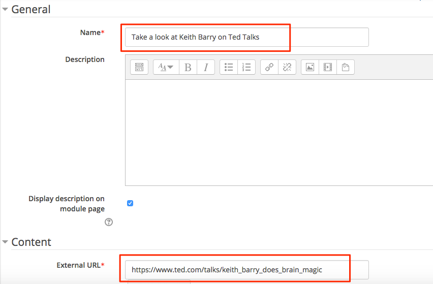

#Pop-overs

If you use video, you can use a **pop-over** that will allow you to display a video but also give the video a text description along with a heading, but we can do this in context i.e. without leaving that page we are on in Moodle.

##Tell me more

This is what the pop-over looks like on the Moodle labs page, notice we don't have to leave the page or the location

##Create your own pop-over

Navigate to this link <a href="https://www.ted.com/talks/keith_barry_does_brain_magic" target="_blank">here</a> and copy the URL

Back in your training module add a URL resource, give it a name then paste in the URL you just copied into the "Eternal URL" field

##The code

Copy the code below, this will allow you to include any video, just replace the link after the iFrame code from your video that you want to copy. Leave `width="420"` and `height="315"` as the dimensions.

~~~html

<h3>Keith Barry</h3>

Watch Keith Barry explain how the mind works

and how the mind is easily manipulated

<iframe src="https://embed-ssl.ted.com/talks/keith_barry_does_brain_magic.html" width="420" height="315" frameborder="0" scrolling="no" webkitallowfullscreen="" mozallowfullscreen="" allowfullscreen=""></iframe>

~~~

Don't for get to tick the "Display description on module page" tick box

Now back in your Training Area you should see your pop-over when you click on the "Tell me more" button

**Continue to Step 02**
