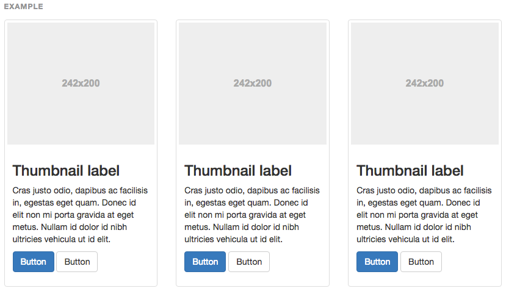
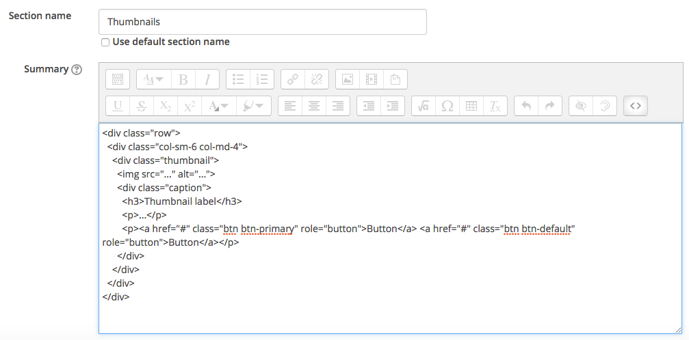

#Thumbnails

Bootstrap thumbnails provide us with the capabilities to incorporate images into Moodle, we can use the **custom content** example, this allows us to combine text with the thumbnail.

##This is what its looks like in Moodle

Remember back in the Moodle Labs module in Moodle we saw Thumbnails in action

##Create your own

- In your Bootstrap tab on your browser navigate to **Thumbnails**
- Choose the custom content example and click the "copy" button 

then click copy

- back in your training area rename section 3 to "Thumbnails"
- paste in the code you have just copied from Bootstrap into the section "Thumbnails" header summary. 

##Nesting code

As you can see the code you just copied into the "Thumbnails" section is just for one component sometime we require more than one component, just like the buttons before in the Announcements.

If we want to create another 2 thumbnails we must paste in the code for the 2 new thumbnails, however we want to keep the thumbnails on the same level (Horizontal)

Like this. 

We need to copy just the code thats inside the main Opening and closing 
 tags (see image below).

Now your are ready to populate the thumbnails with content (text) and images, we look at this in step 03.

*Continue to Step 03*
