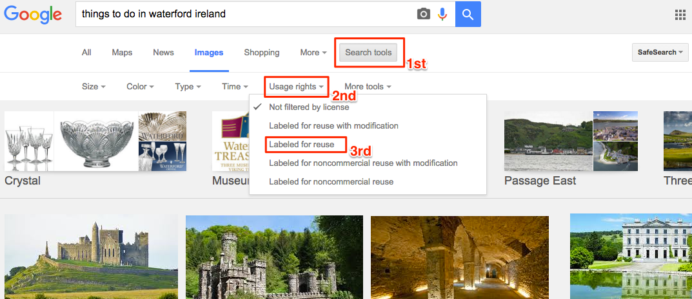
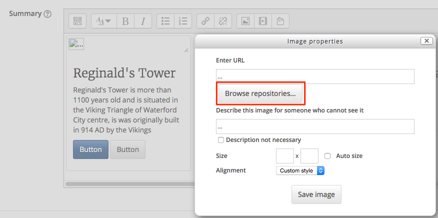

#Populate the Thumbnails

We will populate the thumbnails we created from step 02, we need to place our text and images into each thumbnail.

##Things to do in Waterford

**"Things to do in Waterford"** is our topic that we use to populate the 3 thumbnails, decide on 3 things to do in Waterford, find an Image for each one and find a little text for each one.

##Reginald's Tower

I will show you one that I will demonstrate, you can do the rest, My heading will be **Reginald's Tower** and I will put in some text about Reginald's Tower

##Find your Images

- We need to open a new tab in our browser so we search images, <a href="https://images.google.com/" target="_blank">click here</a> to open a new tab for Google Images

- Search for "things to do in waterford ireland" and we then need to filter for copyright

##Download your images

Decide on 3 images and download them (they will automatically download to you downloads folder).

##Insert your Headings

Delete the heading that is there by default (Thumbnail label) and replace it with your headings.

##Insert your Text

Insert your text about the topic that is there by default (...) and replace it with your text.

##Insert your Image

Insert your images now, remember if you downloaded an image from Google images it's stored in your **downloads** folder.

- when you click in the image icon you will see a window asking you to "Browse Repositories"

Then choose you file from your **downloads** folder and finally upload the image

You will have to repeat these steps for the rest of the thumbnails. 

**Continue to Step 04**
