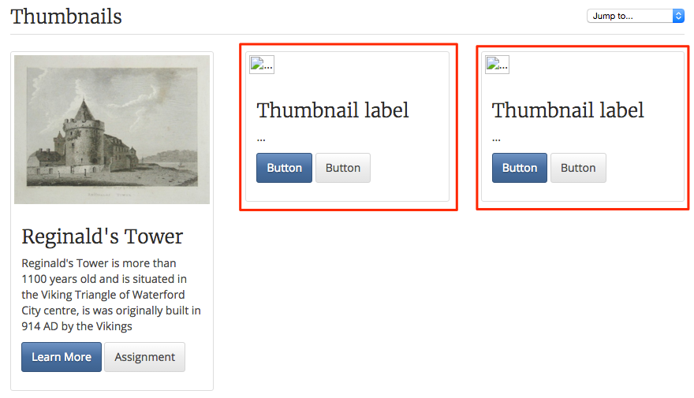

#Finish the Thumbnails

As you can see from the last step we have the image in place along with the text, now we must finish by placing hyperlinks behind the buttons.

##Hyperlinks

Hyperlink from Moodle can either be Internal i.e. to a resource such as a page or an activity such as an Assignment for a forum. 

The general rule is that if your hyperlinking to an external resource we must open the resource in a new tab, however if we are linking to an internal resource we can open the resource in the same tab.

- to open a new tab we must use the `target="blank"` attribute (place it just before the `role="button"`)

##Button Links

I'm going to link to an external website that explains more about Reginald's Tower, but I am also going to link to an internal resource (a Discussion Forum).

- back in you training module turn editing on again and click into the code in the section (Thumbnails) header.

- you need to insert the URL for both your External and Internal Resources i.e. navigate to the resource and copy the URL's.

- paste the URL's into the code within the Button i.e. replace the "#" with the URL

- don't forget the change the names i.e. the text that will appear on the button.

Now the Thumbnail is finished, it has an image that describes what the content is about, some text to introduce the topic and links for more activities

*Continue to Step 05*
