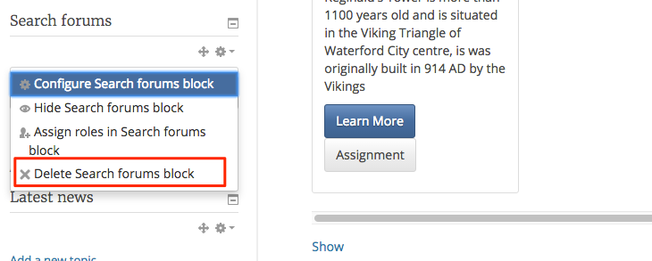
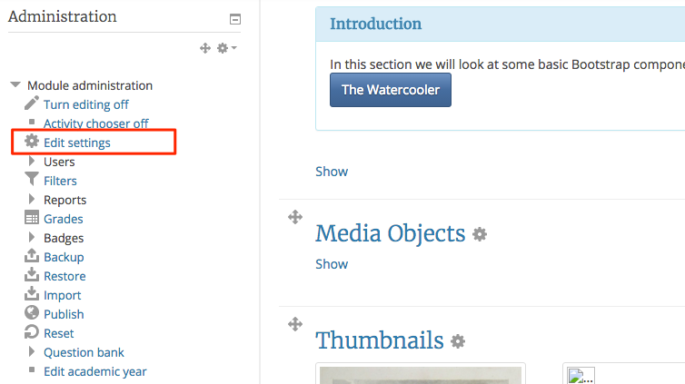
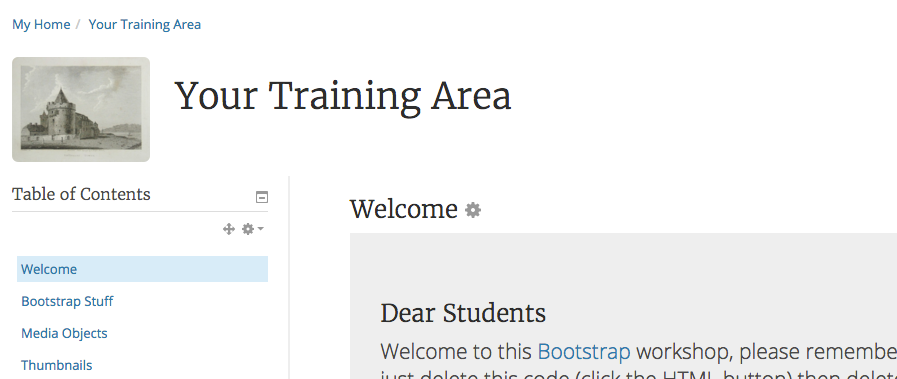

#Housekeeping

We have place in some bootstrap components in order to make the module more engaging and to make it easier to navigate and provide a better user experience.

We need to tidy up our Training Area so we can improve on the work we have done with Bootstrap.

##Delete Blocks 

Blocks are located down the left hand side of the Moodle page in your module, delete all but the essential blocks.

- turn editing on and locate the block you want to delete.

- next hide all the sections that done have a section title, this way the students wont see them.

##Module Image

- with Editing turned on goto "Edit Settings" under Administration (on the left)

- drag and drop an image you downloaded from Google to the "Module summary files"
- next scroll down to "Course Format" and change "Hidden sections" to **Hidden Sections are Completely invisible.
- save changes.

*Continue to Exercises*
