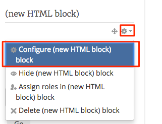
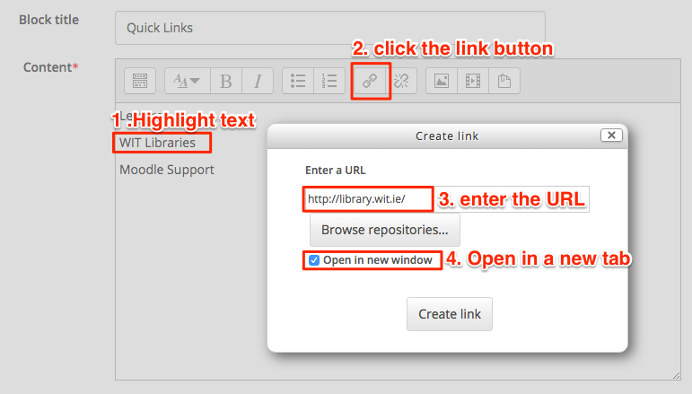

#Exercises

##Exercise 1

Add an HTML block the edit your new block (it will be located on the left-hand side of you Moodle page, it will be called (new HTML block).

- place the following text into the block and place a hyper link behind each entry, you can use "Quick Links" as the title. 

~~~html

Lecturer
WIT Libraries
Moodle Support
~~~

- one at a time get the URL for each entry. 
- now you just need to highlight each entry and click on the link Icon in the screen.

##Exercise 1

Please post you comments or ideas RE bootstrap / Moodle in order for the CTEL to learn new way in which we can support members of staff.

Please post <a href="hhttps://moodle.wit.ie/mod/forum/view.php?id=1615642" target="_blank">here</a> 

